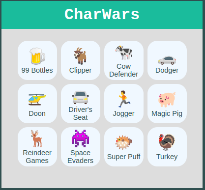
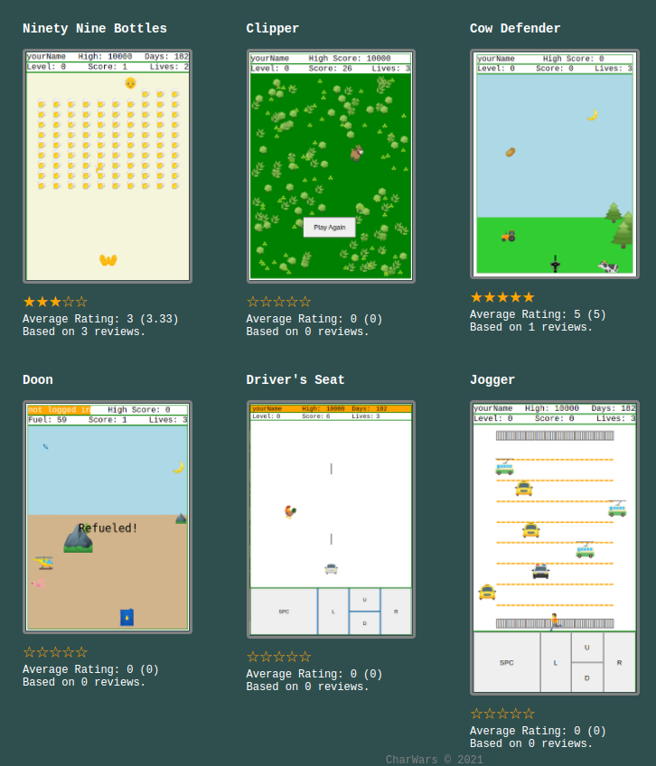
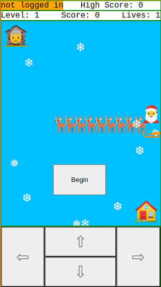

(Privacy Policy: The CharWars Android app does not collect or store any user data.)

# fluffy-adventure
A collection of 2D games that will run in an html browser, mobile friendly.  

## - Download and open a single html file, no installation needed!
## - Completely cross-platform, browser required!
## - Takes up almost no space, less than 64kb!

### Really cheesy graphics!
### Really bad oscillator sounds!
### Really great fun!

### New game "Puffs" 1/31/2022!

## New game "Super Puff" 2/22/2022!
### Now with levels and more sea creatures!

## New game "Turkey" 11/28/2022!
### Watch out for the flying knives!

## New game "Magic Pig" 11/28/2022!
### Just like flappy bird, but a floppy pig!

## New game "Space Evaders" 12/10/2022!
### Give it a try!

## New game "Reindeer Games!  Christmas Special!" 12/24/2022!
### Give it a try!

### For a slightly more sophisticated experience, check out https://www.charwars.net/ to try out games with a little better sound experience and you can also subscribe to see new games.  You can print high score certificates and compete with your friends (or enemies).

-------------------------------------

#### Coming soon: a more formal 2d Video Game Class and Character class.  They are already present in the games themselves, but I intend to do a little refactoring and documenting with the focus on the GUI class, character class, and sound functions, rather than the game itself.

---
## New as of July 4, 2023

### - You can get single files in the single file folder
### - I plan to make the sound library smaller in size soon
### - Everything is more modularized:
#### 1) The video-game-library.js is a single file included/same in all games
#### 2) The html portion of the games is identical and are constructed from the game-core.php include files
#### 3) All games can be built by running buildGames.js in nodeJS and single file apps will be built along with a website directory filled with an index file, the librarys, css, and games.
#### 4) Everything is built from the "game-scripts.js" file folder.  Put the javascript files ie "dodger.js" and "jogger.js" etc and the files will be built.
.
### Note: for the website to be built, it will look in each javascript file for the main character tag.  Somewhere in the javascript game file, place the "main character" tag like below.  The first tag found like this in the file should contain the utf character which will be used when the website is built.

`//<main character>🐄</main character>`

### The Title for the associated link in the main website navigation is taken from the name when the game is built.  For example if the game script contains 
`let cowDefender = new MyLittleVideoGame("Cow Defender");` the website will build an icon showing the title "Cow Defender" with a main character of 🐄;

Here is an example of the website screenshot:

---
