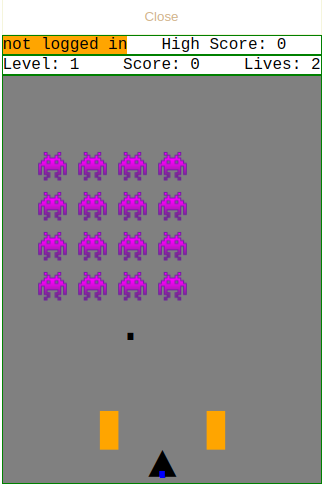
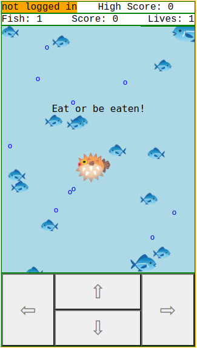
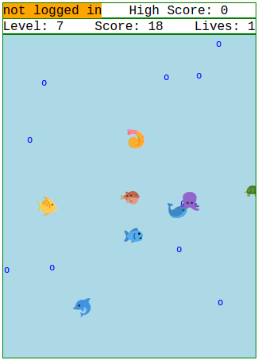
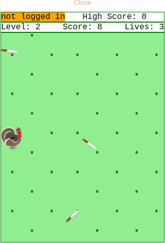
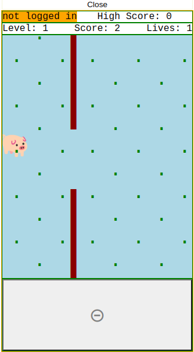

# fluffy-adventure
A collection of 2D games that will run in an html browser, mobile friendly.  

## - Download and open a single html file, no installation needed!
## - Completely cross-platform, browser required!
## - Takes up almost no space, less than 64kb!

### Really cheesy graphics!
### Really bad oscillator sounds!
### Really great fun!

### New game "Puffs" 1/31/2022!

## New game "Super Puff" 2/22/2022!
### Now with levels and more sea creatures!

## New game "Turkey" 11/28/2022!
### Watch out for the flying knives!

## New game "Magic Pig" 11/28/2022!
### Just like flappy bird, but a floppy pig!

### For a slightly more sophisticated experience, check out https://www.charwars.net/ to try out games with a little better sound experience and you can also subscribe to see new games.  You can print high score certificates and compete with your friends (or enemies).

-------------------------------------

#### Coming soon: a more formal 2d Video Game Class and Character class.  They are already present in the games themselves, but I intend to do a little refactoring and documenting with the focus on the GUI class, character class, and sound functions, rather than the game itself.
